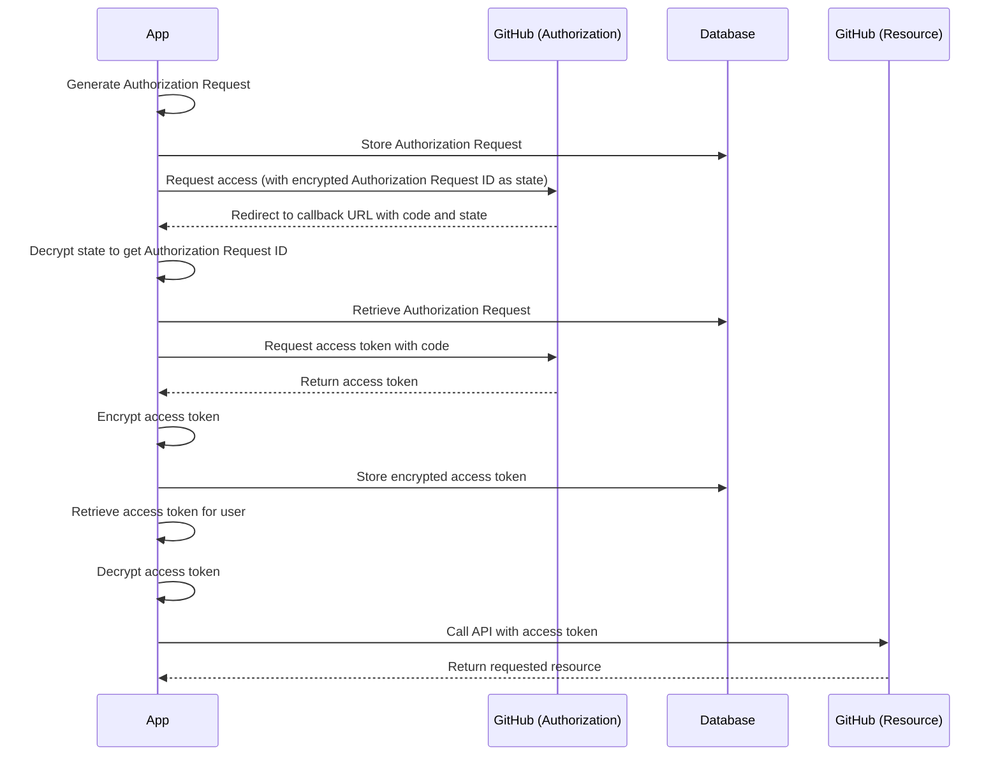

# github-api-integration-poc

This project aims to develop a simple integration using the GitHub API to read the pull requests for each repository
that the user has access to.

## Prerequisites

Before running the project, make sure you have a GitHub OAuth App set up. Follow these steps to set up your app:

1. Go to your GitHub account settings and navigate to the "Developer settings" section.
2. Click on "OAuth Apps" and then click on "New OAuth App".
3. Fill in the required information for your app (e.g., Application name, Homepage URL, Authorization callback URL).
4. Once your app is created, you will find the `Client ID` and `Client Secret` on your app's page. Make a note of these
   as they will be required in the project configuration.

## Installation

1. Clone the repository to your local machine.
2. Create a JSON file called `config.json` in the `flaskr` directory and fill in the following template:

```json
{
  "SECRET_KEY": "your_flask_secret_key",
  "DATABASE_URI": "your_database_uri",
  "GITHUB_CLIENT_ID": "your_github_client_id",
  "GITHUB_CLIENT_SECRET": "your_github_client_secret",
  "ENCRYPTION_KEY": "your_encryption_key"
}
```

### Configuration Key Descriptions

- `SECRET_KEY`: The secret key used by Flask for session management and authentication.
- `DATABASE_URI`: The URI used to connect to the PostgreSQL database. Make sure you have a PostgreSQL server set up.
- `GITHUB_CLIENT_ID`: The client ID is found below the GitHub App ID on your GitHub App's page.
- `GITHUB_CLIENT_SECRET`: The client secret is found below the client ID on your GitHub App's page.
- `ENCRYPTION_KEY`: A long encryption key that will be used to securely encrypt sensitive information.

## Database Setup

- This project requires a PostgreSQL database. You can use the provided Docker Compose file in the `database` directory
  to set up a PostgreSQL server running locally.
- Once the database is set up, navigate to the `flaskr` directory and run the following command to initialize the
  database:

```shell
flask db upgrade
```

## Encryption

The encryption key provided in the `config.json` file is used to encrypt the tokens, ensuring their secure storage.

## OAuth Flow

Here is the OAuth flow that this project follows:

1. The app redirects to GitHub to request access. The app also sends the encrypted id of the authorization request as
   the `state` value in the redirect URL.
2. After the user grants access on GitHub, the app redirects the user back to the app's endpoint along with a `code`
   parameter and the `state` value.
3. The app decrypts the `state` value using the encryption key and retrieves the authorization request associated with
   the decrypted id.
4. The app uses the provided `code` to call the GitHub API and obtain the access token.
5. The access token is then encrypted and stored in the `User` table for future use.
6. When accessing a resource for a specific user, the app retrieves the access token for that user, decrypts it, and
   uses it as a header to call the GitHub API.

Below is a Mermaid sequence diagram representing the OAuth flow described above:

